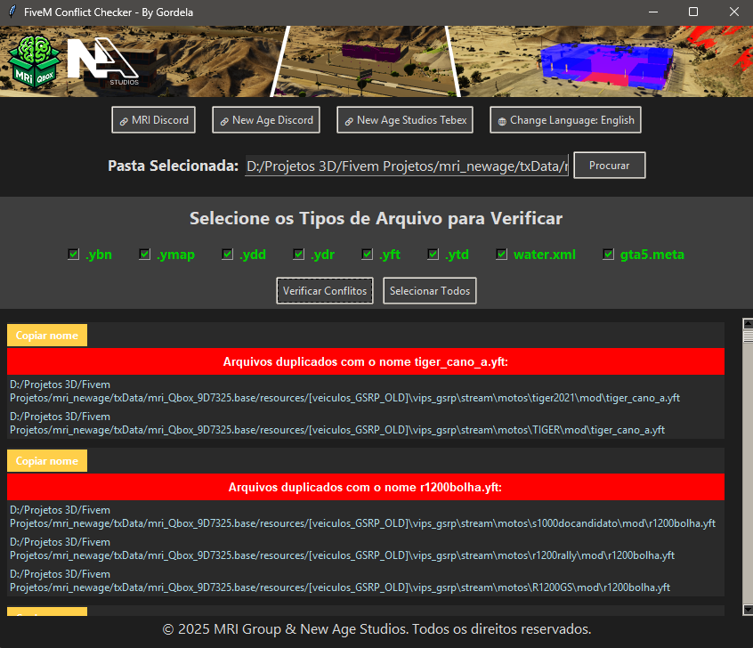

# 🦺 FiveM Conflict Checker

  

  
  
  

The **FiveM Conflict Checker** is a standalone desktop application designed to help server developers identify and manage file conflicts within resource folders.  

Built with performance and ease of use in mind, it offers a dark-themed interface, custom language switching (🇧🇷/🇺🇸), and quick scanning tools to ensure clean and optimized file structures for your FiveM server.

---

## 🔑 Key Features
- Supports scanning for file conflicts by name (e.g., `.ytd`, `.ydd`, `.ymap`, etc.)  
- Easy-to-use GUI with dark theme for comfortable use  
- Fully multilingual: switch between **Português (BR)** and **English (US)** instantly  
- Visual display of duplicate files with clickable paths  
- Built-in tools to copy names, open file locations, and delete duplicates  

---

## 🎯 Common Uses
- Checking mod/resource folders for duplicate asset names  
- Preparing packs for upload or optimization  
- Identifying conflicting map or vehicle files  
- Keeping server assets organized and clean  

---

## 🛠️ Credits
Developed by **New Age Studios** in collaboration with **MRI Group** for use by the FiveM development community.
